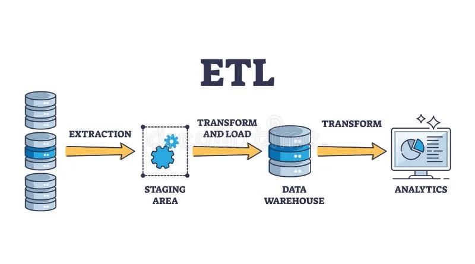

# Flight Data Warehouse Project ✈️

A comprehensive data engineering project implementing a modern data warehouse pipeline for flight analytics, built under the DEPI mentorship program.



## 🚀 Project Overview

This project demonstrates an end-to-end ETL pipeline processing flight data through bronze, silver, and gold layers, culminating in an analytical star schema for business intelligence and reporting.

## 🏗️ Architecture

### Data Flow

### Technology Stack

- **Database & Procedures**: PostgreSQL with DBeaver
- **Data Ingestion**: Python (multi-threading, yield buffers)
- **Data Transformation**: Talend 8.0.1 (pagination)
- **Orchestration**: Apache Airflow
- **Data Modeling**: Star Schema
- **Data Enrichment**: Weather API

## 📊 Data Model

### Dimensions

- `DIM_PASSENGER` - Passenger demographics and loyalty status
- `DIM_FLIGHT` - Flight details and status (6M+ records)
- `DIM_AIRPORT` - Airport geographical information
- `DIM_DATE` - Time intelligence for analysis
- `DIM_TICKET` - Booking class and fare information
- `DIM_PAYMENT` - Payment methods and status
- `DIM_WEATHER` - Weather conditions at flight time (API-enriched)

### Fact Table

- `FACT_BOOKING` - Core business metrics (500K+ records)


## ⚡ Performance Optimizations

### Python ETL

- **Multi-threading** for parallel data processing
- **Yield with buffers** for memory-efficient chunk processing
- **Batch processing** of 6M+ records in DIM_FLIGHT

### Talend Transformation

- **Pagination implementation** for large dataset handling
- **Efficient data cleansing** before Silver/Gold layers
- **Direct loading** to both Silver and Gold layers

- **Talend Parent Job Zip** : https://drive.google.com/file/d/1nBHI3AoUCiO2dknfszf8PRDOlRK9x1Pk/view?usp=sharing

### Airflow Orchestration

- **Daily scheduled workflows**
- **Dependency management** between components
- **Error handling and monitoring**

## 🛠️ Installation & Setup

### Prerequisites

- Python 3.8+
- Apache Airflow 2.0+
- Talend 8.0.1
- PostgreSQL
- DBeaver

### Quick Start

```bash
# Install Python dependencies
pip install -r requirements.txt

# Start Airflow
airflow standalone
```
