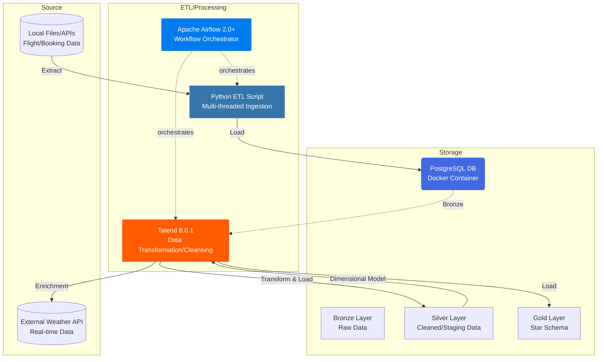

<div align="center">

# ✈️ Flight Data Warehouse Project

[](https://www.docker.com/)
[](https://www.postgresql.org/)
[](https://airflow.apache.org/)
[](https://www.python.org/)
[](https://www.talend.com/)

**A comprehensive data engineering project implementing a modern data warehouse pipeline for flight analytics.**

[Quick Start](#🚀-quick-start) • [Architecture](#📊-architecture) • [Data-Model](#🗄️-data-model) • [Performance](#⚡-performance-optimizations)

</div>

---

## 🚀 Project Overview

This project demonstrates an **end-to-end ETL pipeline** processing raw flight and booking data through **bronze**, **silver**, and **gold** layers, culminating in an analytical **Star Schema** for business intelligence and reporting. Data enrichment is performed by integrating a **Weather API**.

## 📊 Architecture

### Data Flow



### Technology Stack

- **Database & Procedures**: PostgreSQL with DBeaver
- **Data Ingestion**: Python (multi-threading, yield buffers)
- **Data Transformation**: Talend 8.0.1 (pagination)
- **Orchestration**: Apache Airflow
- **Data Modeling**: Star Schema
- **Data Enrichment**: Weather API

## 📊 Data Model

### Dimensions

- `DIM_PASSENGER` - Passenger demographics and loyalty status
- `DIM_FLIGHT` - Flight details and status (6M+ records)
- `DIM_AIRPORT` - Airport geographical information
- `DIM_DATE` - Time intelligence for analysis
- `DIM_TICKET` - Booking class and fare information
- `DIM_PAYMENT` - Payment methods and status
- `DIM_WEATHER` - Weather conditions at flight time (API-enriched)

### Fact Table

- `FACT_BOOKING` - Core business metrics (500K+ records)


---

## 📦 Data Sources & Volume

The pipeline ingests data from two primary sources: a large historical file for flight details and a stream of booking records, enriched with external real-time weather data.

| Data Source      | Volume/Type               | Description                                                    | Format  |
| ---------------- | ------------------------- | -------------------------------------------------------------- | ------- |
| **Flight Data**  | 6M+ Historical Records    | Static dataset for `DIM_FLIGHT` and `DIM_AIRPORT`              | CSV     |
| **Booking Data** | 500K+ Incremental Records | Core transaction data for `FACT_BOOKING` and `DIM_PASSENGER`   | CSV/API |
| **Weather API**  | Real-time                 | Enriched weather conditions linked to flight departure/arrival | JSON    |

---

## ⚡ Performance Optimizations

### Python ETL

- **Multi-threading** for parallel data processing
- **Yield with buffers** for memory-efficient chunk processing
- **Batch processing** of 6M+ records in DIM_FLIGHT

### Talend Transformation

- **Pagination implementation** for large dataset handling
- **Efficient data cleansing** before Silver/Gold layers
- **Direct loading** to both Silver and Gold layers

- **Talend Parent Job Zip** : https://drive.google.com/file/d/1nBHI3AoUCiO2dknfszf8PRDOlRK9x1Pk/view?usp=sharing

### Airflow Orchestration

- **Daily scheduled workflows**
- **Dependency management** between components
- **Error handling and monitoring**

## 🛠️ Installation & Setup

# Required

- Python 3.8+
- Apache Airflow 2.0+
- Talend 8.0.1 (Desktop Application)
- Docker Engine 20.10+ (for PostgreSQL DB)
- DBeaver (or any PostgreSQL client)

### Quick Start

```bash
docker compose up --build -d

# Wait for services to be healthy (2-3 minutes)
docker compose ps

```

### Access Web UIs

| Service              | URL                   | Credentials   |
| -------------------- | --------------------- | ------------- |
| **Airflow**          | http://localhost:8082 | admin / admin |
| **Spark Master**     | http://localhost:8080 | -             |
| **HDFS NameNode**    | http://localhost:9870 | -             |
| **Jupyter Notebook** | http://localhost:8888 | -             |

## 📁 File Structure

```
ETL-FLIGHT/
├── airflow
│   ├── config
│   ├── dags
│   ├── logs
│   └── plugins
├── config
├── dags
├── data
├── docker-compose.env
├── docker-compose.yml
├── Dockerfile
├── Dockerfile.kafka-connect
├── drivers
│   └── postgresql-42.7.7.jar
├── etl-flight
│   ├── airlines_modified.csv
│   ├── airport.csv
│   ├── api.py
│   ├── bronze_layer_workflows.py
│   ├── common.py
│   ├── constants.py
│   ├── flights_airlines.csv
│   ├── flights_modified.csv
│   ├── jobInfo.properties
│   ├── lib
│   ├── main.py
│   ├── parent_job
│   ├── __pycache__
│   └── requirements.txt
├── etl_scripts
├── flights_airlines.csv
├── flights_modified.csv
├── images
│   ├── architecture.png
│   └── tables.png
├── jobInfo.properties
├── kafka_scripts
│   ├── hsperfdata_root
│   ├── kafka_consumer.py
│   ├── kafka_consumer_stream.py
│   ├── kafka_streaming_job.py
│   ├── spark-5abf7a35-4957-412d-b3a2-30ff589f0315
│   ├── spark-659f5745-06a0-4fdd-b0c4-38537ee2a0b9
├── logs
│   └── scheduler
├── myenv
│   ├── bin
│   ├── include
│   ├── lib
│   ├── lib64 -> lib
│   └── pyvenv.cfg
├── notebooks
│   ├── producer.py
│   ├── sample_spark.ipynb
│   └── spark_local_temp
├── parent_job
│   ├── airport_dim_0_1.jar
│   ├── booking_fact_0_1.jar
│   ├── date_dim_0_1.jar
│   ├── depi
│   ├── flight_dim_0_1.jar
│   ├── items
│   ├── log4j2.xml
│   ├── parent_job_0_1.jar
│   ├── parent_job_run.bat
│   ├── parent_job_run.ps1
│   ├── parent_job_run.sh
│   ├── passenger_dim_0_1.jar
│   ├── payment_dim_0_1.jar
│   ├── src
│   ├── ticket_dim_0_1.jar
│   ├── weather_dim_0_1.jar
│   └── xmlMappings
├── parent_job_localhost.zip
├── parent_job_worker.zip
├── README.md
├── scripts
│   ├── hadoop
│   └── pyspark
├── spark_drivers
├── talend_jobs
```

---

## 🔄 Airflow DAG: ETL-Flight

The main DAG orchestrates the complete ETL pipeline with 12 tasks:

```mermaid
graph LR
    subgraph "Setup & Ingestion (Bronze)"
        A[wait_for_postgres\nDB Health Check] --> B[python_load_flights\nIngest DIM_FLIGHT (6M+)]
        A --> C[python_load_bookings\nIngest FACT_BOOKING (500K+)]
    end

    subgraph "Transformation (Silver & Gold)"
        B --> D[talend_clean_silver\nCleanse & Stage Data]
        C --> D
        D --> E[talend_dim_build\nBuild Dimensions]
        E --> F[talend_fact_load\nLoad FACT_BOOKING]
        F --> G[weather_api_enrich\nEnrich DIM_WEATHER]
    end

    subgraph "Validation & Finish"
        G --> H[validate_gold_schema\nCheck Star Schema]
        H --> I[pipeline_complete\nDone]
    end

    style A fill:#4FC3F7,stroke:#0288D1,color:#000,stroke-width:2px
    style B fill:#3776AB,stroke:#1D4B7D,color:#fff,stroke-width:3px
    style C fill:#3776AB,stroke:#1D4B7D,color:#fff,stroke-width:3px
    style D fill:#FF7043,stroke:#D84315,color:#fff,stroke-width:3px
    style E fill:#FFD54F,stroke:#F57C00,color:#000,stroke-width:2px
    style F fill:#FFD54F,stroke:#F57C00,color:#000,stroke-width:2px
    style G fill:#BA68C8,stroke:#7B1FA2,color:#fff,stroke-width:2px
    style H fill:#81C784,stroke:#388E3C,color:#000,stroke-width:2px
    style I fill:#66BB6A,stroke:#2E7D32,color:#fff,stroke-width:3px
```

**Pipeline Duration**: ~4-6 minutes  
**Critical Path**: Spark ETL job takes ~4 minutes

---

## 🛠️ Technology Stack

### Data Technologies

| Technology       | Version | Role                | Why Chosen                                                              |
| ---------------- | ------- | ------------------- | ----------------------------------------------------------------------- |
| **Apache Spark** | 3.3.0   | ETL Engine          | Industry standard for big data processing, supports batch and streaming |
| **Apache Hive**  | 2.3.2   | Data Warehouse      | SQL interface, Parquet storage, integrates with Hadoop ecosystem        |
| **HDFS**         | 3.3.5   | Distributed Storage | Fault-tolerant, scalable storage for big data                           |
| **SQL Server**   | 2022    | Source Database     | Enterprise-grade RDBMS, supports advanced features                      |

### Orchestration & Infrastructure

| Technology         | Version | Role                   | Why Chosen                                        |
| ------------------ | ------- | ---------------------- | ------------------------------------------------- |
| **Apache Airflow** | 2.7.3   | Workflow Orchestration | Programmable workflows, rich UI, strong community |
| **Docker**         | 20.10+  | Containerization       | Consistent environments, easy deployment          |
| **PostgreSQL**     | 13      | Airflow Metadata       | Reliable metadata store for Airflow               |
| **Redis**          | Latest  | Message Broker         | Fast Celery executor backend for Airflow          |

## ✨ Features ✈️

### Core Capabilities

**📊 Complete ETL Pipeline: Automated data movement from local files/APIs through Bronze, Silver, and Gold layers in PostgreSQL**

**🔄 Workflow Orchestration: Apache Airflow manages complex, multi-stage DAGs with dependencies between Python ingestion and Talend transformation jobs.**

**⚡ High-Volume Ingestion: Python scripts use multi-threading and yield buffers for memory-efficient and fast loading of large datasets (e.g., 6M+ flight records).**

**🧩 Complex Transformation: Talend 8.0.1 handles data cleansing, standardization, and dimensional modeling, including pagination for large data flows.**

**🎯 Star Schema: Optimized dimensional model with 7 Dimension Tables and 1 Fact Table for high-performance flight analytics.**

**☁️ Data Enrichment: Integrated Weather API to enrich the DIM_WEATHER table, providing context for flight delays and operational analysis.**

**🐳 Containerized Database: The entire data warehouse is hosted on a Dockerized PostgreSQL instance for a stable and easily reproducible environment.**

**🔌 Direct Connectivity: JDBC/ODBC connectivity between Talend and the PostgreSQL data warehouse for efficient data manipulation.**

---

## 🔧 Troubleshooting

### Common Issues & Solutions

<details>
<summary><strong>🔴 Airflow tasks stuck in "queued"</strong></summary>

**Symptoms**: Tasks remain in "queued" state indefinitely

**Root Cause**: Redis not on same Docker network as Airflow

**Solution**:

```yaml
# In docker-compose.yml, ensure Redis has:
redis:
  networks:
    - kafka-net # Add this network
```

**Verify**:

```bash
docker exec etl-flight-airflow-worker-1 redis-cli -h redis ping
# Should return: PONG
```

</details>
